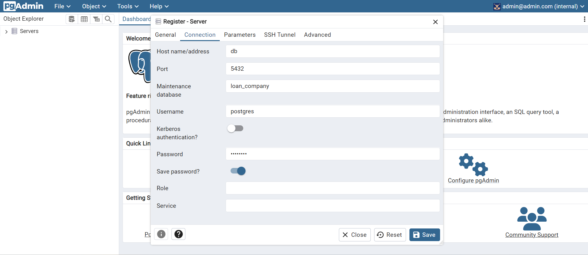

# Dockerized ETL, PostgreSQL, pgAdmin, Backend Setup, Streamlit Setup

## Branches

This repository contains the following branches:

- **main**: The primary branch containing the complete project setup.
<!-- - **db-setup**: Contains:
  - the database setup and configuration.
  - ETL (Extract, Transform, Load) process implementation

- **backend:** Contains the backend with `FastAPI`.
- **front**: Contains the Streamlit frontend application. -->
- **gh-pages:** Deploying the documentation.
- **jupyter-notebook**: Contains the Jupyter Notebook container setup.


## Presentation 

**Follow to [this](https://hovhannisyan91.github.io/pythonmicroservicedesign/) link.**

## Installation

Before getting started, ensure you have the following prerequisites installed:

1. Clone the repository:
   ```bash
   git clone https://github.com/hovhannisyan91/pythonmicroservicedesign.git
   ```

2. Build and start the Docker containers:
   ```bash
   docker-compose up --build
   ```

## Access the Application

After running `docker-compose up --build`, you can access each component of the application at the following URLs:


- **Streamlit Frontend:** http://localhost:8501 The main interface for managing employees, built with Streamlit. Use this to add, view, update, and delete employee records.
- **FastAPI Backend**: [http://localhost:8008](http://localhost:8008)  
  The backend API where requests are processed. You can use tools like [Swagger UI](http://localhost:8008/docs) (provided by FastAPI) to explore the API endpoints and their details.

- **PgAdmin** (optional): [http://localhost:5050](http://localhost:5050)  
  A graphical tool for PostgreSQL, which allows you to view and manage the database. Login using the credentials set in the `.env` file:
  
  - **Email**: Value of `PGADMIN_EMAIL` in your `.env` file
  - **Password**: Value of `PGADMIN_PASSWORD` in your `.env` file

> Note: Ensure Docker is running, and all environment variables in `.env` are correctly configured before accessing these URLs.


## Project Structure

Here’s an overview of the project’s file structure:

```bash
.
├── LICENSE
├── README.md
├── .github
├── .env                # Environment variables
├── docker-compose.yml  # Docker Compose configuration
├── api                 # FastAPI backend folder
│   ├── Dockerfile      # Dockerfile for FastAPI container
│   ├── __init__.py     # Marks this directory as a package
│   ├── main.py         # FastAPI main entry point
│   ├── database.py     # Database configuration and connection setup
│   ├── models.py       # SQLAlchemy models for database tables
│   ├── schema.py       # Pydantic schemas for request and response validation
│   └── requirements.txt # Backend dependencies
├── app                 # Streamlit frontend folder
│   ├── Dockerfile      # Dockerfile for Streamlit container
│   ├── __init__.py
│   ├── app.py          # Streamlit main entry point
│   ├── pages           # Additional pages for Streamlit
│   │   ├── page1.py
│   │   └── page2.py
│   └── requirements.txt #frontend dependancies
└── docs                # Documentation assets
    ├── imgs            # Image assets for documentation
    └── index.html      # Documentation home page
```

## Docker 

This repository sets up a Docker environment with three main services:

1. **PostgreSQL:** for data storage
2. **pgAdmin:** for database management and visualization
3. **ETL:** service for Extract, Transform, Load operations using Python

## Prerequisites

Before running this setup, ensure Docker and Docker Compose are installed on your system.


- Docker: [Install Docker](https://docs.docker.com/get-docker/)
- Docker Compose: [Install Docker Compose](https://docs.docker.com/compose/install/)


## DB

- Access pgAdmin for PostgreSQL management: [http://localhost:5050](http://localhost:5050)
    - username: admin@admin.com 
    - password: admin
    - When running for the first time, you must create a server. Configure it as shown in the below image (Password is blurred it should be `password`.)
    

### Environment Variables

Create a `.env` file in the root directory to define your environment variables as below:

```env
# PostgreSQL configuration
DB_USER=<your_database_user>
DB_PASSWORD=<your_database_password>
DB_NAME=<your_database_name>

# pgAdmin configuration
PGADMIN_EMAIL=admin@admin.com
PGADMIN_PASSWORD=admin
```


## ETL

### Schema Design

We will try to create below schema:


### ETL

In `models.py`, we have used `sqlalchemy` package, which allows map python objects with SQL objects.

By running `etl.py` following objects will be created:
    - sql tables 
    - the data sets will store in `data\` folder
    - the csv files will be loaded into DB

## API


### Features

- **Add New Employee**: Enter details like first name, last name, email, department, position, and salary to add a new employee.
- **Get Employee by ID**: Retrieve an employee’s information using their unique ID.
- **Update Salary**: Update the salary of an existing employee by providing their ID and the new salary.
- **Delete Employee**: Remove an employee record from the system using their ID.

In this folder you can find the codes that connects endpoints with the DB you can insert, delete, updated, and check employee with there id's.

### Requests

- `POST /employees/: Create a new employee. Requests`

- `GET /employees/{employee_id}: Retrieve employee details by ID. Requests`

- `PUT /employees/{employee_id}: Update an employee’s salary by ID. Requests`

- `DELETE /employees/{employee_id}: Delete an employee by ID.`


## Web Application

Adding another service named app, which is going to be responsible for the frontend.

To Open the web app visit: [here](http://localhost:8501/)


### Dockerfile

```bash
# Dockerfile

# pull the official docker image
FROM python:3.10-slim-bullseye

RUN apt-get update && apt-get install -y \
    build-essential libpq-dev libfreetype6-dev libpng-dev libjpeg-dev \
    libblas-dev liblapack-dev gfortran \
    && rm -rf /var/lib/apt/lists/*

# set work directory
WORKDIR /app


# Copy the requirements file and install dependencies
COPY requirements.txt .
RUN pip install --no-cache-dir -r requirements.txt

# Copy the contents of the front directory to /app in the container
COPY . .

# Expose Streamlit's default port
EXPOSE 8501

# Run the Streamlit application
CMD ["streamlit", "run", "app.py", "--server.port=8501", "--server.headless=true", "--server.runOnSave=true"] 
```


### Service

```yaml
  app:
    container_name: streamlit_app
    build:
      context: ./app
      dockerfile: Dockerfile
    ports:
      - 8501:8501
    environment:
      - API_URL=http://api:8000
    depends_on:
      - api
```

## Mkdocs

Mkdocs documents your code and puts it in html format.

### Prerequisites

- `pip install mkdocs-material`
- `pip install 'mkdocstrings[python]'`

### How to use


1. Create `docs` folder
2. Create respective `.md ` files with proper links
3. `mkdocs new .` to create `mkdocs.yaml` and folder docs that has `index.md` and folder
4. To show your documentation type `mkdocs serve` and click on the browser connection to open it in your browser.
5. create a new folder `.github/workflows`
6. create `ci.yaml` file

#### mkdocs.yaml

```yaml
name: ci 
on:
  push:
    branches:
      - master 
      - main
permissions:
  contents: write
jobs:
  deploy:
    runs-on: ubuntu-latest
    steps:
      - uses: actions/checkout@v3
      - uses: actions/setup-python@v4
        with:
          python-version: 3.x
      - uses: actions/cache@v2
        with:
          key: ${{ github.ref }}
          path: .cache
      - run: pip install mkdocs-material
      - run: pip install "mkdocstrings[python]"
      - run: pip install pillow cairosvg
      - run: mkdocs gh-deploy --force
```

#### ci.yaml

```yaml
name: ci 
on:
  push:
    branches:
      - master 
      - main
permissions:
  contents: write
jobs:
  deploy:
    runs-on: ubuntu-latest
    steps:
      - uses: actions/checkout@v3
      - uses: actions/setup-python@v4
        with:
          python-version: 3.x
      - uses: actions/cache@v2
        with:
          key: ${{ github.ref }}
          path: .cache
      - run: pip install mkdocs-material
      - run: pip install "mkdocstrings[python]"
      - run: pip install pillow cairosvg
      - run: mkdocs gh-deploy --force
```